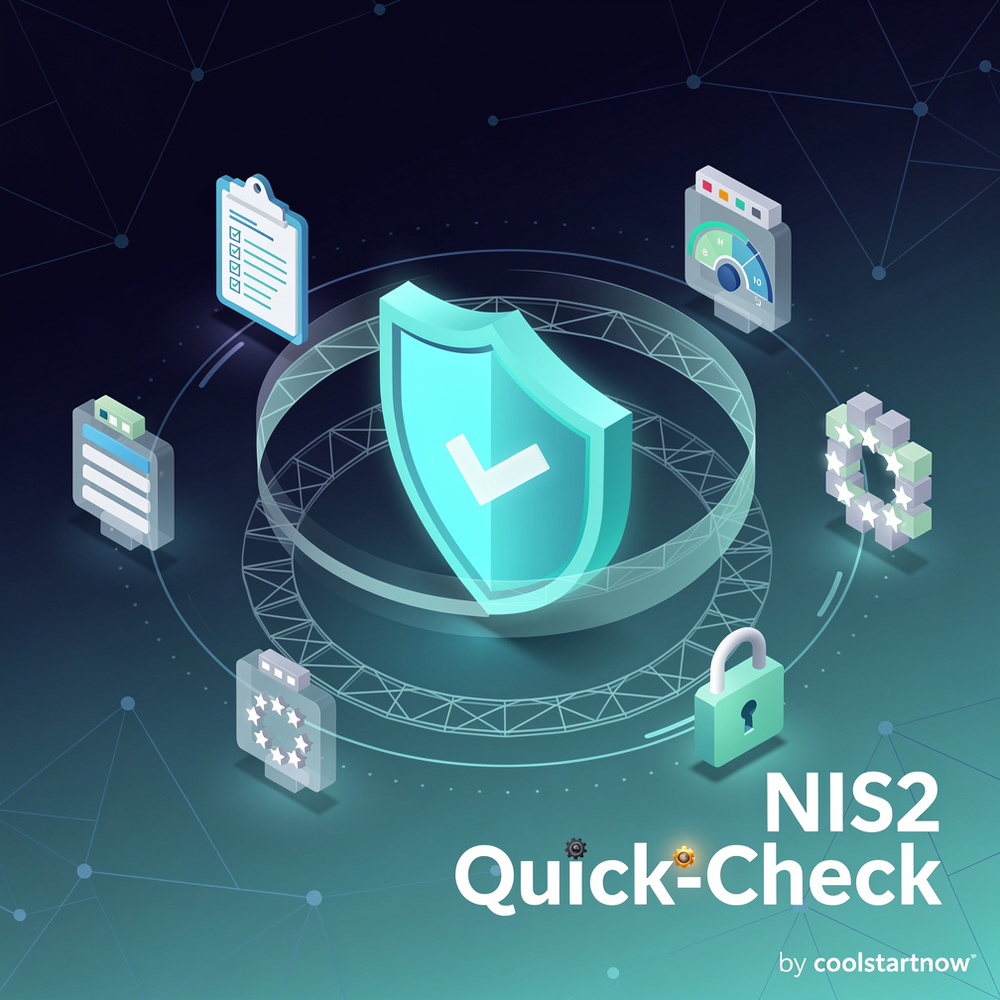

<!-- © 2026 Claude Hecker — NIS2 Quick-Check — AGPL-3.0 -->

# NIS2 Quick-Check

A free, fully client-side self-check to get a rough estimate of your implementation status
against the ten measure areas in Article 21(2) of the NIS2 Directive.

**🌍 Fully translated into all 24 official EU languages** — every domain, question, help text,
country entry and UI string. Not just DE/EN — genuinely all 24, with no machine-translation
fallback.

📖 **[Wiki](https://github.com/coolstartnow/nis2-quickcheck/wiki)** — Home, FAQ, Methodology,
Languages & Country Data

> 🔗 **From the same author: [ISMS Builder](https://github.com/coolstartnow/isms-builder)** —
> a self-hosted, open-source ISMS platform covering ISO 27001, NIS2, GDPR/DSGVO and BSI
> IT-Grundschutz. This quick-check is a good first step before setting up a full ISMS.

**Standalone tool** — not part of, and not dependent on, ISMS Builder. A later integration
(e.g. as a module inside ISMS Builder) is possible but deliberately not part of this release.

## Usage

🚀 **Try it live: https://coolstartnow.github.io/nis2-quickcheck/** — no install needed,
runs entirely in your browser (see [Features](#features) below).

No installation, no build step, no server required — just open `index.html` in a browser:

```bash
xdg-open index.html   # Linux
# or: open index.html (macOS) / double-click in Explorer (Windows)
```

Alternatively, serve it with any static web server, e.g.:

```bash
python3 -m http.server 8080
```

## Features

- 10 domains × 5 questions (50 questions total) per NIS2 Art. 21(2)(a)–(j), maturity scale 0–4
- Automatic rough classification Essential/Important by sector + company size
- Result dashboard: bar chart, radar chart, gap analysis with priorities
- Country information for the country selected in your profile: competent authority, national
  law, transposition status (all 27 EU member states included)
- PDF export via the browser's print function (no separate PDF tool needed)
- JSON export/import to save, share, and resume an assessment
- Automatic browser autosave (`localStorage`) — nothing is lost on reload
- Dark mode
- Runs entirely locally — no data ever leaves the browser, no tracking, no cloud connection

## Languages

**Fully translated into all 24 official EU languages**: Bulgarian, Croatian, Czech, Danish,
Dutch, English, Estonian, Finnish, French, German, Greek, Hungarian, Irish, Italian, Latvian,
Lithuanian, Maltese, Polish, Portuguese, Romanian, Slovak, Slovenian, Spanish, Swedish —
every domain, question, country entry, and UI string (`data.js`, `i18n.js`).

Deliberately no automatic language fallback without quality control — should a further
language ever be added before it's fully translated, the built-in fallback in `i18n.js`
(`t()`/`tl()`) falls back to English until translation is complete.

## Important note

**Not a substitute for legal advice.** This tool provides non-binding orientation only.
Binding classification and implementation obligations depend on the respective national
transposition of the NIS2 Directive and change continuously — please confirm with the
competent national authority or qualified legal counsel before any decision.

The country data (`data.js`, `COUNTRY_DATA`) reflects the status as of the date named in
`COUNTRY_DATA_ASOF` and is maintained manually — there is no automatic update.

## Changelog

- **v1.0.1** — Import button ("Load saved assessment") on the welcome screen now has an icon,
  so it's easier to spot next to the primary "Start" button.
- **v1.0.0** — Initial release: 10 domains × 5 questions, classification, result dashboard,
  all 27 EU member states, all 24 official EU languages, JSON export/import, PDF export,
  autosave, dark mode.

## Origin & license

Developed independently. The rough thematic structure (10 NIS2 domains, country overview as
a concept) was inspired by a thematically related but unlicensed third-party project — all
text, questions, and data were written from scratch; no code was reused.

© 2026 Claude Hecker — [AGPL-3.0](LICENSE)
